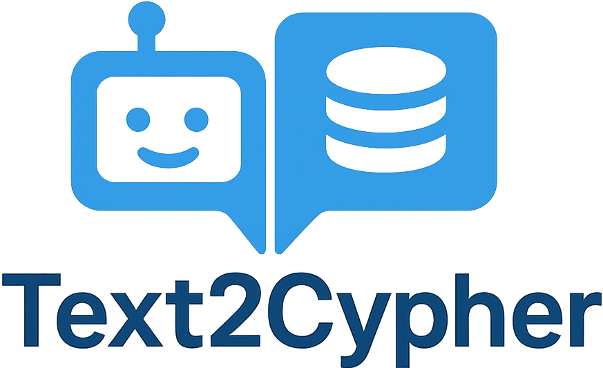

# text-to-cypher
A lightweight framework converting natural language queries into Neo4j Cypher scripts using AI agent-based frameworks and LLMs, with optional OpenAI Assistant integration and frontend UI.

## Web-based UI

A new web-based UI  (`ui` directory) has been added, enabling users to easily ask questions and receive Cypher scripts interactively via a browser. It defaults to using the `o4-mini` model or a customizable OpenAI Assistant, providing significantly improved accuracy and lower operational costs compared to the original AI agent setups.


The backend now exposes `/api/schema`, returning the loaded Neo4j schema as JSON. The UI shows this information in a side panel for quick reference.
For more details and setup instructions, see the [UI README](ui/README.md).

---

## AI Agent-based Framework Setup

The following instructions are for setting up and running the lightweight AI agent-based frameworks.

### Prerequisites

- Git
- Miniconda (with Mamba)

### Setup

1. Clone the repository:
   ```sh
   git clone git@github.com:nickzren/text-to-cypher.git
   ```
2. Initialize conda environment:
   ```sh
   cd text-to-cypher
   mamba env create -f environment.yml
   ```
3. Update the `.env` file to set `OPENAI_API_KEY`.

### Run

1. Init environment:
   ```sh
   cd text-to-cypher
   conda activate text-to-cypher
   ```
2. Run example scripts:
   ```sh
   export PYTHONPATH="$PYTHONPATH:$(pwd)"
   python src/text2cypher_agent.py 
   Ask> Show compounds that treat both type 2 diabetes mellitus and hypertension.

   MATCH (c1:Compound)-[:TREATS_CtD]->(d1:Disease {name: 'type 2 diabetes mellitus'}), 
   (c1)-[:TREATS_CtD]->(d2:Disease {name: 'hypertension'})
   RETURN c1, d1, d2
   ```

### Data

The file `data/input/neo4j_schema.json` contains a Neo4j schema. While the example uses the Hetionet Neo4j database, the export_neo4j_schema.py script can be used to export the schema from **any** Neo4j database.

To set up the Hetionet Neo4j Docker container locally, follow the instructions from [this link](https://github.com/nickzren/hetionet/tree/main?tab=readme-ov-file#docker-setup-and-initialization).

If you need to export the schema from your own Neo4j instance, first update the `.env` file to set `DB_URL` and `DB_NAME`.

Then, run the following command to export the schema:
```sh
python src/export_neo4j_schema.py --output_dir data/input/
```

You can also access the Neo4j Browser at http://localhost:7474 to run the Cypher queries generated by the text-to-cypher framework.

### Schema Hints (Optional)

For unclear abbreviations in your schema, create `data/input/schema_hints.json`:

```json
{
  "relationships": {
    "OBSCURE_AbC": "A does something to C"
  }
}

---

## Neo4j schema guidelines (LLM‑friendly)

LLMs can only “see” the schema you expose, so a precise, self‑describing graph leads to dramatically better text‑to‑Cypher results.

| # | Guideline | Why it matters |
|---|-----------|----------------|
| **1** | **One label = one entity (singular noun)** – `Disease`, `Drug`, `Gene`, … | Avoids synonym / over‑loaded labels, keeping queries unambiguous.  [oai_citation_attribution:0‡Neo4j](https://neo4j.com/docs/cypher-manual/current/syntax/naming/?utm_source=chatgpt.com) |
| **2** | **Relationship type = `SOURCE_VERB_TARGET` in `UPPER_SNAKE_CASE`**<br>Use verbs from the [OBO Relation Ontology](https://obofoundry.org/ontology/ro.html) where possible (e.g. `GENE_ASSOCIATED_WITH_DISEASE`, `DRUG_TREATS_DISEASE`). | Verbal, directional names read like English, helping both humans and models infer intent.  [oai_citation_attribution:1‡Neo4j Online Community](https://community.neo4j.com/t/cypher-basic-syntax/22950?utm_source=chatgpt.com) [oai_citation_attribution:2‡obofoundry.org](https://obofoundry.org/ontology/ro.html?utm_source=chatgpt.com) |
| **3** | **Properties in lowerCamelCase with clear semantics** – `approvalYear`, `uniprotId` | Consistent keys let the model project properties confidently.  [oai_citation_attribution:3‡Neo4j](https://neo4j.com/docs/cypher-manual/current/syntax/naming/?utm_source=chatgpt.com) |
| **4** | **Define constraints & indexes up‑front** – `CREATE CONSTRAINT ... IS UNIQUE` on natural keys, composite indexes for frequent filters | Prevents duplicates, speeds queries, and signals “canonical” identifiers to the LLM.  [oai_citation_attribution:4‡Neo4j](https://neo4j.com/docs/spark/current/write/schema-optimization/?utm_source=chatgpt.com) |
| **5** | **Ban “generic” nodes or relationships** – no catch‑all `Entity` label or `RELATED_TO` relationship | Specificity keeps generated Cypher terse and correct. |
| **6** | **Document required vs optional properties** (table or JSON) | Gives both humans *and* the model a ground truth for projection. |
| **7** | **Be ruthlessly consistent** – once you pick a style, never mix alternatives | Consistency is the strongest signal the LLM gets.  [oai_citation_attribution:5‡Neo4j](https://neo4j.com/docs/cypher-manual/current/syntax/naming/?utm_source=chatgpt.com) |

> **Bottom line** – if a new teammate can understand your graph without extra docs, an LLM probably can too.
