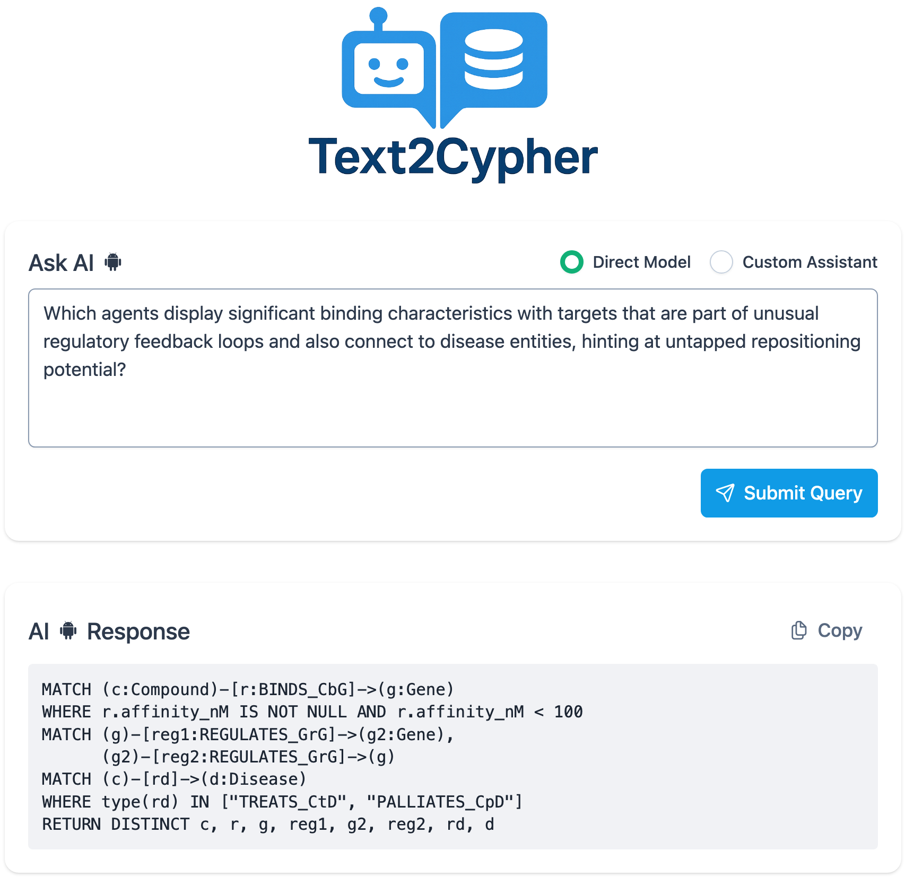

# Text-to-Cypher UI



---

## 🛠 Tech Stack

- **Vue 3**
- **PrimeVue**
- **TypeScript**
- **Vite**
- **Axios**

---

## 🚀 Initial Setup

**Step 1: Install Dependencies**

From the `ui` directory, run:

```bash
npm install
```

**Step 2: ▶️ Running the Frontend & Backend**

Start the frontend development server, from the `ui` directory, run:
```bash
npm run dev
```

Launch the backend API (FastAPI), back to root directory, run:
```bash
uvicorn src.api_server:app --reload
```
